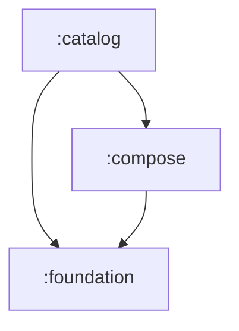

# Architecture

## Module Graph



`:catalog` depends on `:compose` (and transitively on `:foundation`).
`:compose` depends on `:foundation`.
`:foundation` has zero external dependencies.

## Modules

### `:foundation`

**Zero external dependencies. Pure Kotlin.**

The single source of truth for all design tokens. Framework-agnostic by design:
values are primitive types (`Long` for colors, `Float` for sizes) so this module
can be consumed by Compose, the Android View system, and AOSP build system
(`Android.bp`) without modification.

```
foundation/src/commonMain/kotlin/framework/cortena/ui/
├── color/
│   ├── ColorTokens.kt      # raw ARGB Long values (internal)
│   ├── AdaptiveColor.kt    # light + dark color pair
│   ├── ColorToken.kt       # public adaptive color palette
│   └── Palette.kt          # semantic roles (background, primary, error…)
├── typography/
│   ├── TypeScale.kt        # raw sp Float values
│   └── Typography.kt       # semantic roles (bodyMedium, titleLarge…)
└── spacing/
    └── Spacing.kt          # 4dp grid (Xs=4, Sm=8, Md=16…)
```

### `:compose`

Compose wrappers and theme layer. Depends on `:foundation`.
Converts foundation tokens (`Long`/`Float`) to Compose types (`Color`, `TextUnit`, `Dp`).
Provides `Theme { }` entry point via `CompositionLocalProvider`.

The module is split into `commonMain` (multiplatform-ready) and `androidMain` (Android-specific platform code).

#### `commonMain` — Shared Compose Layer

```
compose/src/commonMain/kotlin/framework/cortena/ui/
├── annotation/
│   └── ExperimentalComponentsApi.kt   # opt-in annotation for unstable APIs
├── components/
│   ├── Button.kt            # interactive button with 5 styles, 2 variants
│   ├── Separator.kt         # horizontal / vertical divider line
│   ├── Slider.kt            # continuous + discrete value slider
│   ├── Text.kt              # semantic text with 15 TextRole variants
│   └── Toggle.kt            # spring-animated switch with drag + tap
├── graphics/
│   └── shadow/
│       ├── Shadow.kt                  # shadow data class (radius, offset, color)
│       ├── ShadowModifier.kt          # Modifier.componentShadow
│       ├── InnerShadow.kt            # inner shadow rendering
│       └── InnerShadowModifier.kt     # Modifier.innerShadow
├── interaction/
│   ├── DampedAnimation.kt            # spring-physics animation driver
│   ├── InteractiveAnimation.kt       # graphicsLayer press/drag transforms
│   ├── InteractiveHighlight.kt       # highlight composable (commonMain)
│   ├── InteractiveHighlightColor.kt  # highlight color utilities
│   └── PressGesture.kt              # inspectDragGestures helper
├── layout/
│   ├── AppBar.kt            # top app bar slot
│   ├── Body.kt              # edge-to-edge root wrapper
│   ├── SafeArea.kt          # system insets padding
│   └── ScrollView.kt        # scrollable content container
├── shape/
│   ├── CapsuleShape.kt     # stadium / pill shape
│   ├── ComponentShape.kt   # base shape interface
│   ├── CornerRadii.kt      # per-corner radius spec
│   ├── CornerStyle.kt      # round vs cut corner mode
│   ├── RectangleShape.kt   # sharp rectangle
│   ├── RoundedShape.kt     # uniform rounded rectangle
│   ├── ShapeCopy.kt        # immutable copy helpers
│   ├── ShapeLerp.kt        # shape interpolation
│   └── UnevenShape.kt      # per-corner radius shape
└── theme/
    ├── ColorExtensions.kt         # ColorToken.value() helpers
    ├── LocalProviders.kt          # CompositionLocal definitions
    ├── StatusBarIconMode.kt       # Light / Dark / Auto enum
    ├── Theme.kt                   # Theme() composable entry point
    └── ThemeMode.kt               # Light / Dark / Auto enum
```

#### `androidMain` — Android Platform Code

```
compose/src/androidMain/kotlin/framework/cortena/ui/
├── graphics/
│   └── shadow/              # platform shadow rendering (RenderNode)
├── interaction/
│   ├── InteractiveHighlight.kt       # Android-specific highlight with shader
│   └── InteractiveHighlightShader.kt # AGSL shader for glow effects
└── layout/
    └── ContentView.kt       # ComponentActivity.ContentView() entry point
```

### `:catalog`

Showcase app. Depends on `:compose` (and transitively `:foundation`).
Used to develop and visually verify all components in a live environment.

```
catalog/src/main/java/framework/cortena/ui/catalog/
├── MainActivity.kt          # main activity with theme toggle
└── demo/
    ├── Button.kt            # ButtonDemo()
    ├── Color.kt             # ColorDemo() — responsive palette grid
    ├── ScrollView.kt        # ScrollViewDemo()
    ├── Slider.kt            # SliderDemo()
    ├── Toggle.kt            # ToggleDemo()
    └── Typography.kt        # TypographyDemo() — all 15 TextRoles + advanced features
```

## Theme System

### CompositionLocal Providers

The theme layer exposes five `CompositionLocal` keys, each provided by the `Theme()` composable:

| Key                 | Type         | Default             | Purpose                                       |
| ------------------- | ------------ | ------------------- | --------------------------------------------- |
| `LocalIsDark`       | `Boolean`    | `false`             | Whether the current theme is dark mode        |
| `LocalColors`       | `Palette`    | `LightPalette`      | Semantic color roles for the active theme     |
| `LocalContentColor` | `Color?`     | `null`              | Inherited foreground color (scoped by parent) |
| `LocalTypography`   | `Typography` | `DefaultTypography` | Semantic text style scales                    |
| `LocalSpacing`      | `Spacing`    | `Spacing`           | 4dp-grid spacing tokens                       |

### ThemeMode Resolution

`ThemeMode.Auto` delegates to `isSystemInDarkTheme()` inside the `Theme()` composable,
ensuring consistent behavior without manual system-theme checks in outer layouts.

### ContentView Entry Point (Android)

`ComponentActivity.ContentView()` is the recommended Android entry point. It:

1. Calls `enableEdgeToEdge()` for transparent system bars.
2. Wraps content inside `Theme()` with the provided `themeMode`, `palette`, and `typography`.
3. Manages status bar icon contrast (`StatusBarIconMode`) reactively via `SideEffect`.
4. Renders an optional status bar color overlay and `appBar` slot above the main content.

## Component Design Patterns

### Interaction Model

All interactive components (Button, Slider, Toggle) share a common physics-based interaction system:

1. **`DampedAnimation`** — Central animation driver with spring-physics for position, press feedback (scale), and velocity tracking. Uses `Job`-tracked coroutines to prevent stale animation conflicts on rapid successive interactions.
2. **`inspectDragGestures`** — Low-level gesture detector that emits `onDragStart`, `onDrag`, `onDragEnd`, and `onDragCancel` callbacks without consuming pointer events (allowing parent scroll to still function).
3. **`applyInteractiveAnimation`** — `graphicsLayer` extension that applies press-scale, translation, and feedback transforms in a single pass.
4. **`InteractiveHighlight`** — Platform-specific glow/highlight effect (AGSL shader on Android).

### Color Resolution

Components follow a consistent pattern for resolving colors:

```kotlin
val resolvedColor = if (customColor.isSpecified) customColor else Color(colors.semanticRole)
```

This allows per-instance color overrides while defaulting to theme-aware semantic roles.

### Shadow System

The `componentShadow` modifier renders drop shadows that remain visible during scale animations (unlike standard `Modifier.shadow` which clips at the original bounds). This is critical for interactive components like Toggle and Slider indicators.

## Documentation

Component documentation is maintained in `docs/components/` following a standardized format:

| Document         | Component                    |
| ---------------- | ---------------------------- |
| `AppBar.md`      | Top app bar                  |
| `Body.md`        | Edge-to-edge root wrapper    |
| `Button.md`      | Interactive button           |
| `ContentView.md` | Android activity entry point |
| `SafeArea.md`    | System insets padding        |
| `ScrollView.md`  | Scrollable container         |
| `Separator.md`   | Visual divider line          |
| `Slider.md`      | Value adjustment slider      |
| `Text.md`        | Semantic text component      |
| `Theme.md`       | Theme composable             |
| `Toggle.md`      | Switch / toggle              |

Each document follows the structure: **Concept → API Reference → Parameters Table → Examples**.

## Design Decisions

**Why are colors stored as Long?**
`androidx.compose.ui.graphics.Color` is a Compose type. Storing raw `Long` in
`:foundation` means the token layer has zero dependency on Compose — it can
be referenced from `Android.bp` builds for ROM integration without pulling
in the entire Compose runtime.

**Why a separate `:compose` module?**
When ROM integration comes, `:foundation` goes into the system image. Compose
components live in apps. Keeping them in separate modules makes that boundary
explicit and enforceable by the build system.

**Why `commonMain` / `androidMain` split in `:compose`?**
The component APIs, shapes, and theme logic are multiplatform-ready in `commonMain`.
Platform-specific code (edge-to-edge window management, AGSL shaders, `RenderNode` shadows)
lives in `androidMain`. This separation enables future targets (Desktop, iOS) with
minimal refactoring.

**Why `DampedAnimation` instead of `Animatable` directly?**
`DampedAnimation` encapsulates the full interactive lifecycle (press → drag → release)
with coordinated spring animations for position, scale, and velocity. It manages
coroutine job tracking internally so components don't need to handle animation
cancellation logic, preventing thumb-stuck bugs during rapid interactions.
